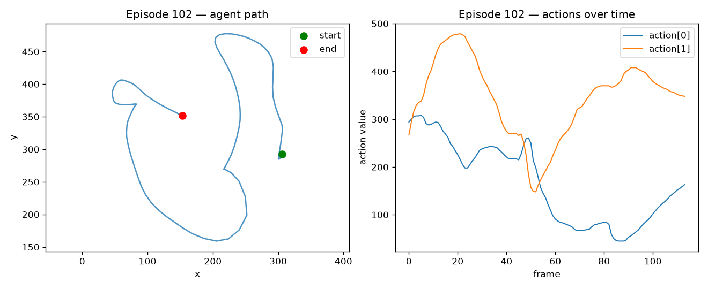
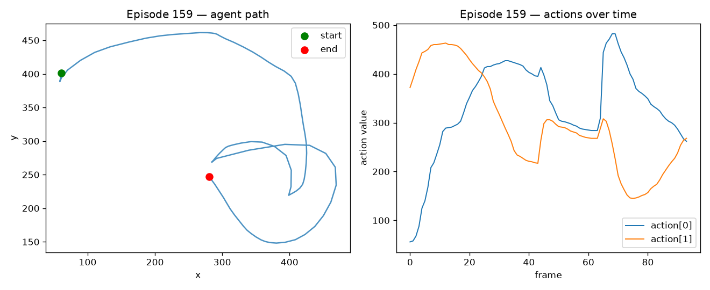

# DemoGuard — demonstration quality scoring for imitation learning

DemoGuard automatically scores the quality of robot demonstrations in an
imitation-learning dataset, flags the low-quality ones, and shows that training
a policy on the **filtered** dataset beats training on the **polluted** one.

Built on the [LeRobot](https://github.com/huggingface/lerobot) `pusht` dataset
(206 human demonstrations of pushing a T-shaped block to a target).

---

## Why this matters

Imitation-learning policies copy whatever they are shown. A handful of sloppy,
jerky, or mislabeled demonstrations can quietly degrade the trained policy, and
on large teleoperation datasets nobody has time to review every episode by hand.
DemoGuard scores every demonstration **without labels** so the bad ones can be
caught and removed before training.

---

## Results

### 1. Detector — catching bad demonstrations (the headline result)

25% of the demonstrations were deliberately corrupted (jitter, acceleration
spikes, reversed segments) with a known ground-truth list. Each episode is then
scored, unsupervised, and the scores are evaluated against that ground truth.

| Detector | ROC-AUC | Avg precision |
|---|---|---|
| Isolation Forest (trajectory statistics) | 0.956 | 0.837 |
| Autoencoder (trajectory shape) | 0.960 | 0.951 |
| **Composite (blend)** | **0.990** | **0.972** |

The two detectors look at the data differently — the Isolation Forest at summary
statistics (jerk, path efficiency, reversals), the autoencoder at the
resampled trajectory shape — so blending them beats either alone. The composite
ranks corrupted demonstrations above clean ones almost perfectly (AUC 0.99).

### 2. Downstream — does filtering help the policy?

Three ACT policies were trained under identical settings (20k steps), then
evaluated over 50 episodes in `gym-pusht`. The comparison metric is
`avg_max_reward` (continuous overlap with the target); `pc_success` is near the
floor at this training budget and is too noisy to compare.

| Training set | avg_max_reward |
|---|---|
| Clean (206 episodes) | 0.344 |
| Polluted (206, 52 corrupted) | 0.333 |
| **Filtered (154, detector-cleaned)** | **0.362** |

Corruption hurt the policy (0.344 → 0.333). Filtering the detector-flagged
demonstrations recovered and slightly exceeded the clean baseline (→ 0.362).
The robust claim is **filtered > polluted**: removing what the detector flagged
measurably improved the policy. (See *Limitations* — these are single-seed runs.)

---

## How it works

```
load → features → score → corrupt(known labels) → evaluate detector → train (full / polluted / filtered) → compare
```

1. **Features** (`src/features/trajectory_features.py`) — per episode: length,
   mean jerk, max acceleration, action reversal rate, path efficiency, mean speed.
2. **Isolation Forest** (`src/scoring/isoforest.py`) — unsupervised outlier score
   over the standardized features.
3. **Autoencoder** (`src/scoring/autoencoder.py`) — a small PyTorch autoencoder
   over each trajectory resampled to a fixed length; reconstruction error is the
   anomaly score.
4. **Composite** (`src/scoring/composite.py`) — blends the two and evaluates all
   three against the known corruption labels.
5. **Corruption + detector eval** (`src/data/corrupt.py`) — injects known-bad
   demonstrations and measures precision / recall / AUC.
6. **Polluted dataset** (`src/data/corrupt_dataset.py`, `fix_parquet_schema.py`)
   — writes a corrupted copy of the dataset to disk for the training comparison.
7. **Filtering + comparison** (`src/experiment/make_filtered_list.py`,
   `src/policy/evaluate.py`) — drops detector-flagged episodes, trains, and logs
   results to MLflow.

### Example: a flagged demonstration vs a clean one

A clean demonstration (left) follows a smooth, deliberate path. The
worst-scored episode (right) is jerky and tangled — high jerk and acceleration,
exactly what the detector keys on.

| Clean (episode 102) | Flagged (episode 159) |
|---|---|
|  |  |

---

## Interactive demo

```bash
streamlit run demo/app.py
```

A two-tab Streamlit app: a **Summary** of the detector AUCs and downstream
comparison, and an **Episode explorer** to browse every demonstration, see its
Isolation-Forest / autoencoder / composite scores, whether DemoGuard flagged it,
and its trajectory.


---

## Reproducing the results

```bash
# 1. environment (Python 3.12+, required by LeRobot v0.5)
conda create -n demoguard python=3.12 -y
conda activate demoguard
pip install -r requirements.txt
conda install -c conda-forge ffmpeg -y    # for video decoding on macOS

# 2. explore + features + scores
python -m src.data.load                   # load pusht, plot one episode
python -m src.features.trajectory_features # per-episode feature table
python -m src.scoring.isoforest           # isolation-forest quality scores

# 3. detector evaluation (the headline result)
python -m src.data.corrupt                # inject corruption, report precision/recall/AUC
python -m src.scoring.composite           # isoforest vs autoencoder vs composite (AUC table)

# 4. downstream comparison
python -m src.data.corrupt_dataset        # write polluted dataset to disk
python -m src.data.fix_parquet_schema     # restore fixed_size_list schema
python -m src.experiment.make_filtered_list  # detector-flagged -> keep list

# train three policies (each ~45 min on Apple Silicon / MPS)
PYTORCH_ENABLE_MPS_FALLBACK=1 lerobot-train --policy.type=act \
  --dataset.repo_id=lerobot/pusht --env.type=pusht \
  --output_dir=outputs/train/baseline_act_full --policy.device=mps \
  --policy.push_to_hub=false --batch_size=8 --steps=20000 \
  --save_freq=20000 --eval_freq=20001 --wandb.enable=false

# (polluted: add --dataset.root=outputs/datasets/pusht_polluted)
# (filtered: also add --dataset.episodes="[<keep list>]")

# evaluate any checkpoint (logs avg_max_reward + pc_success to MLflow)
python -m src.policy.evaluate \
  --checkpoint outputs/train/baseline_act_full/checkpoints/last/pretrained_model \
  --n-episodes 50

# view tracked runs
mlflow ui --backend-store-uri sqlite:///results/mlflow.db
```

---

## Stack

LeRobot (v0.5, dataset format v3.0) · PyTorch · scikit-learn · gym-pusht ·
MLflow · pandas / NumPy · matplotlib · Streamlit. Policy: ACT. Task: PushT.

---

## Limitations & future work

- **Single-seed downstream runs.** The training comparison is directional, not
  statistically tight. The honest next step is 3 seeds per condition with
  mean ± std; `filtered > polluted` is expected to hold, while the smaller
  `filtered > clean` gap may be noise.
- **Low absolute policy performance.** Trained for 20k steps (reference PushT
  policies use ~200k), so `pc_success` sits near 0–2%. This is a compute budget
  choice, not a method limitation — the *relative* comparison is what matters.
- **Synthetic corruption.** Corruption is injected rather than naturally
  occurring; it validates the detector under known labels. Applying DemoGuard to
  naturally low-quality demonstrations is future work.
- **Corruption is applied to state/action, not video.** The detector operates on
  trajectories; image-space corruption is out of scope.

---

## Repository layout

```
src/
  data/        load, corrupt, corrupt_dataset, fix_parquet_schema
  features/    trajectory_features
  scoring/     isoforest, autoencoder, composite
  policy/      evaluate
  experiment/  make_filtered_list
demo/          app.py (Streamlit)
results/       feature/score CSVs, plots, MLflow db
configs/       default.yaml
```
